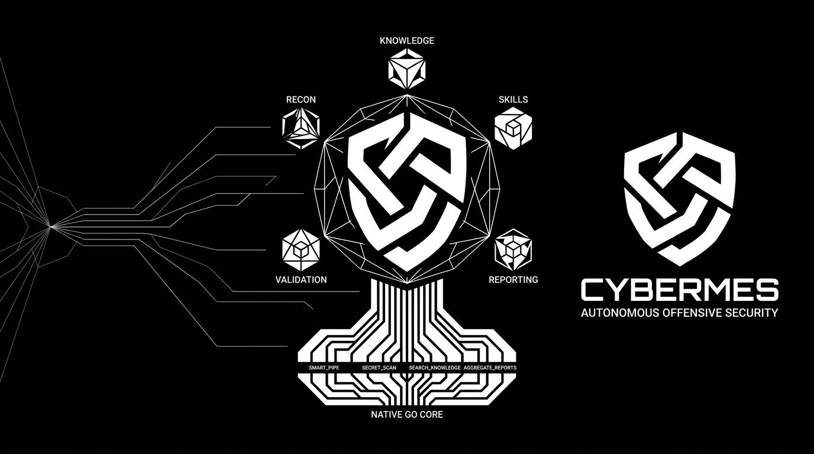
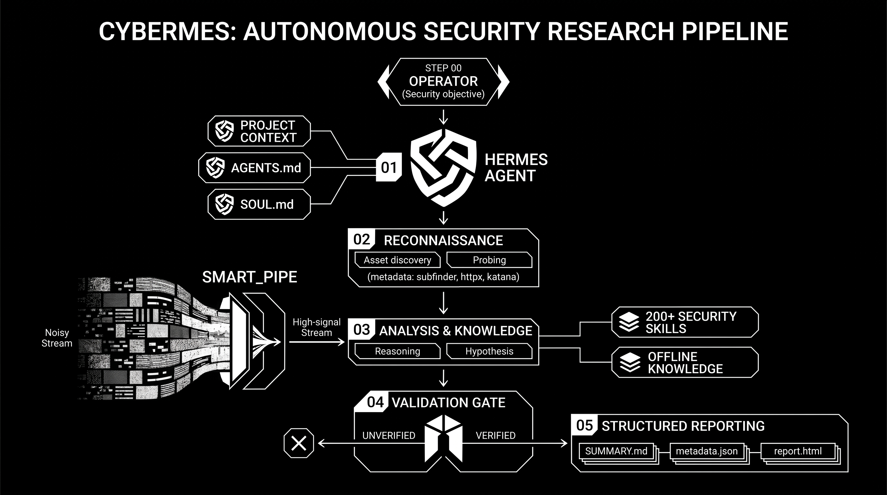
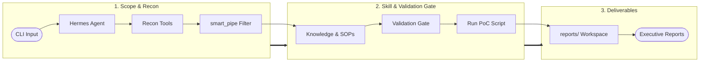
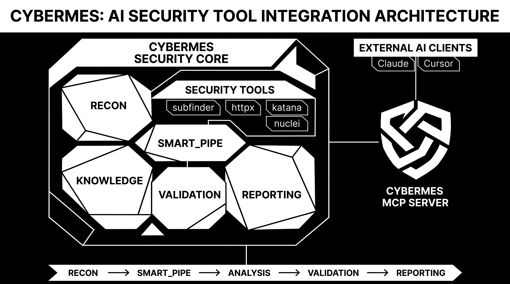
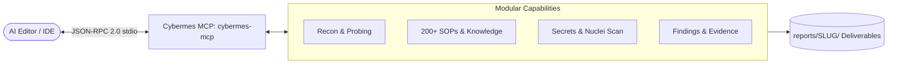

<div align="center">

# Cybermes

**Autonomous Offensive Security & Bug Bounty Automation Framework**

[](https://github.com/Zyrexnn/Cybermes/releases)
[](https://go.dev/)
[](https://www.python.org/)
[](docs/MCP_SETUP.md)
[](LICENSE)
[](#installation--setup)



<p align="center">
  <b>Cybermes</b> is an offensive security assistant and automation framework designed for authorized bug bounty hunting, reconnaissance, vulnerability research, and structured reporting.
  <br>
  It combines native Go performance utilities, 200+ modular offensive security playbooks, token-optimized streaming pipelines, and full Model Context Protocol (MCP) support for AI coding environments.
</p>

[Installation](#installation--setup) • [Architecture](#architecture--operational-pipeline) • [Why Cybermes?](#why-cybermes) • [Features](#core-features) • [Workspace Structure](#target-workspace--deliverables) • [Toolchain](#toolchain) • [Documentation](docs/)

</div>

---

## Installation & Setup

Cybermes can be used directly through your AI assistant via **Model Context Protocol (MCP)** or executed as a **standalone CLI / pipeline**.

### 1. MCP Server Installation (Recommended for AI Workflows)

Cybermes includes a high-performance native Go MCP server (`cybermes-mcp`) that exposes 10+ security tools and context providers directly to AI coding environments (**Google Antigravity / Gemini**, **Kilo Code**, **Cursor**, **Claude Desktop**, **Windsurf**, **Cline**, **Roo Code**, **OpenCode**, **Claude Code CLI**, **Continue.dev**, **Zed**, **Hermes**, and **Codex**).

#### Universal Auto-Installer (1-Click)
```bash
# Auto-detect and configure all installed AI clients
npx -y cybermes-mcp install

# Install ONLY to specific AI providers:
npx -y cybermes-mcp install --kilo
npx -y cybermes-mcp install --gemini --cursor
```

#### Global Installation (No NPX Startup Latency)
```bash
npm install -g cybermes-mcp
cybermes-mcp install --global
```

#### Local Interactive MCP Manager & Optimizer
```bash
# Windows
.\mcp.bat            # or .\mcp.ps1

# Linux / macOS
./mcp.sh             # or python3 scripts/mcp.py
```

#### Manual Client Configuration
To manually register the MCP server in your client configuration (`mcpServers` section):
```json
{
  "mcpServers": {
    "cybermes": {
      "command": "npx",
      "args": ["-y", "cybermes-mcp"]
    }
  }
}
```

> For client-specific paths, direct flags (`--kilo`, `--gemini`, `--global`, `--dry-run`), and native binary setup, see the **[MCP Integration Guide](docs/MCP_SETUP.md)**.

---

### 2. Standalone CLI Installation

If you plan to run Cybermes directly from the terminal or in headless CI/CD pipelines:

#### Windows (Native PowerShell)
```powershell
# Clone repository and execute installer
git clone https://github.com/Zyrexnn/Cybermes.git
cd Cybermes
.\setup_windows.ps1

# Configure environment variables and API keys
notepad .env
```
*(For WSL2 or manual setups, refer to the [Windows Installation Guide](docs/INSTALL_WINDOWS.md))*

#### Linux / macOS
```bash
# Clone repository and execute installer
git clone https://github.com/Zyrexnn/Cybermes.git
cd Cybermes
./setup.sh

# Configure environment variables and API keys
nano .env
```

#### Docker Container
```bash
git clone https://github.com/Zyrexnn/Cybermes.git && cd Cybermes
cp .env.example .env && nano .env
docker compose up -d
```

---

### 3. Environment Health Check

Verify system dependencies, path bindings, and tool integrity:

```bash
# Run environment diagnostics
python tools/doctor.py

# Automatically resolve and repair missing components
python tools/doctor.py --fix
```

---

### 4. Running an Assessment

```bash
# Linux / macOS
./cybermes "Assess https://example.com"

# Windows
.\cybermes.bat "Assess https://example.com"

# Docker
docker compose exec cybermes cybermes "Assess https://example.com"
```

> **Local Testing**: Run the included mock vulnerable application in `examples/`:
> ```bash
> python examples/mock_vulnerable_app.py   # Starts mock app on http://127.0.0.1:8888
> ./cybermes "Assess http://127.0.0.1:8888"
> ```

---

## Architecture & Operational Pipeline

Cybermes provides two distinct operational workflows tailored to different execution environments:
1. **Autonomous Hermes CLI Workflow**: Fully autonomous terminal/headless execution where the local Hermes engine reasons, spawns subprocesses, filters streaming outputs via `smart_pipe`, and executes validation loops directly on the OS.
2. **Model Context Protocol (MCP) Server Workflow**: Client-Server architecture exposing 10+ high-performance native Go tools and 200+ security SOPs over JSON-RPC 2.0 stdio to external AI coding assistants and IDEs (Gemini/Antigravity, Claude Desktop, Cursor, Windsurf, Cline, Roo Code).

### 1. 🤖 Autonomous Hermes CLI Workflow

The standalone CLI mode utilizes the built-in **Hermes Agent** engine (`hermes.exe` / `cybermes`) as an autonomous reasoning brain. The operator provides a target prompt, and Hermes autonomously maps the attack surface, invokes CLI binaries, filters outputs through `smart_pipe` to prevent LLM context saturation, verifies hypotheses with standalone PoC scripts, and produces executive reports.

<div align="center">
  
</div>

#### Hermes CLI Execution Flow:



#### Hermes Pipeline Stages:
1. **Target Ingestion & Scope Validation**: Operator issues a single CLI prompt. Hermes resolves domain boundaries and initializes target workspace directories (`recon/<TARGET_SLUG>/` and `reports/<TARGET_SLUG>/`).
2. **Autonomous Toolchain Orchestration**: Hermes spawns external reconnaissance tools (`subfinder`, `httpx`, `katana`, `ffuf`) in sequence.
3. **High-Speed Stream Filtering (`smart_pipe`)**: Raw outputs are archived to disk in `recon/` while `smart_pipe` streams only relevant endpoints, HTTP status codes, and leaked secrets into Hermes' context window.
4. **Hypothesis & Skill Retrieval**: Hermes queries the offline database (`search_knowledge`) and loads relevant offensive playbooks from `skills/`.
5. **Deterministic PoC Validation Gate**: Hermes writes and executes a non-destructive script (`pocs/poc_<vuln>.py`), capturing raw HTTP request/response evidence.
6. **Report Compilation**: Calls native Go `aggregate_reports` and `generate_pdf.py` to compile `SUMMARY.md`, `metadata.json`, interactive `report.html`, and `REPORT.pdf`.

---

### 2. 🔌 Cybermes MCP Server Workflow

In the MCP workflow, **Cybermes operates as a native JSON-RPC 2.0 server (`cybermes-mcp`)** providing specialized security tools, prompts, and context providers directly to external AI assistants and IDEs (Cursor, Antigravity / Gemini, Claude, Windsurf, VS Code / Cline). The external model acts as the reasoning engine while Cybermes handles high-speed tool execution, local knowledge lookups, and reporting.

<div align="center">
  
</div>

#### MCP Protocol Execution Flow:



#### MCP Tooling & Interaction Lifecycle:
1. **Handshake & Discovery**: AI Client starts `cybermes-mcp` via stdio and discovers exposed tools, schemas, and resource templates.
2. **Environment & Scope Assessment**: The AI invokes `cybermes_validate_scope` and `cybermes_check_environment` to inspect target authorization and system tool health.
3. **Structured Recon & Secret Mining**: AI executes `cybermes_recon_crawl`, `cybermes_http_probe`, or `cybermes_scan_secrets`. The MCP server executes compiled routines and returns clean, structured JSON results without context bloat.
4. **On-Demand Playbook & Exploit Lookup**: When a vulnerability vector is identified, the AI calls `cybermes_search_knowledge` and `cybermes_get_skill` to retrieve targeted exploitation steps in sub-50ms.
5. **Deterministic Evidence Recording & Aggregation**: AI logs verified findings with `cybermes_record_finding` / `cybermes_record_evidence` and compiles target deliverables via `cybermes_aggregate_report`.

---

### 3. ⚖️ Hermes CLI vs. Cybermes MCP Comparison

| Feature / Dimension | 🤖 Hermes CLI Workflow | 🔌 Cybermes MCP Workflow |
| :--- | :--- | :--- |
| **Primary Interface** | Terminal / PowerShell / Docker CLI | AI Coding Editors / IDEs / Web Chat (JSON-RPC) |
| **Reasoning Engine** | Built-in Hermes Autonomous Agent (`hermes.exe`) | Host AI Client (Gemini, Claude 3.7, GPT-4o, etc.) |
| **Execution Model** | Autonomous sub-process loop from CLI prompt | Modular Tool & Context calls requested by the AI |
| **Token Optimization** | OS pipe streaming via Go `smart_pipe` | Native JSON-RPC schema with compact response filters |
| **Knowledge Access** | CLI binary execution (`search_knowledge`) | In-memory MCP tools (`cybermes_search_knowledge`, `cybermes_get_skill`) |
| **Deliverables Output** | Direct filesystem generation in `reports/<TARGET_SLUG>/` | Programmatic management via `cybermes_aggregate_report` |

---

## Why Cybermes?

| Challenge | Traditional Approach | Cybermes Solution |
| :--- | :--- | :--- |
| **AI Assistant Integration** | Manual copy-pasting of terminal outputs or fragile custom wrappers. | **Native Go MCP Server (`cybermes-mcp`)**: Standardized JSON-RPC 2.0 integration exposing 10+ security tools directly to AI clients. |
| **LLM Token & Context Noise** | Fuzzer/crawler outputs flood context with thousands of lines of 404s and static assets. | **High-Speed Stream Filter (`smart_pipe`)**: Pure Go filter that archives raw logs to disk while streaming only high-signal endpoints, status codes, and secrets. |
| **Exploit Verification** | Speculative or pattern-matched alerts without reproducible verification. | **Zero-False-Positive PoC Gate**: Requires standalone, non-destructive Python scripts (`pocs/poc_<name>.py`) and raw HTTP traces before logging findings. |
| **Payload & Methodology Retrieval** | Manually searching external wikis, repositories, and cheat sheets online. | **Sub-50ms Local Knowledge Base (`search_knowledge`)**: Instant offline query engine across 200+ SOP playbooks, PayloadsAllTheThings, and HackTricks datasets. |
| **Structured Deliverables** | Unorganized text dumps requiring tedious manual report compilation. | **Multi-Format Report Aggregator**: Automated generation of `SUMMARY.md`, `metadata.json`, standalone interactive HTML, and print-ready `REPORT.pdf`. |
| **OS & Environment Portability** | Most offensive tools assume Kali/Linux, complicating Windows setups. | **Native Multi-Platform Support**: Automated native installers for Windows (PowerShell), Linux, macOS, and Docker with a built-in health check and repair tool (`doctor.py`). |

---

## Core Features

- **Native Go Toolchain**: Zero-overhead compiled utilities for output stream filtering (`smart_pipe`), credential scanning (`secret_scan`), offline knowledge retrieval (`search_knowledge`), and report aggregation (`aggregate_reports`).
- **Model Context Protocol (MCP)**: Native Go MCP server (`cybermes-mcp`) exposing security tools and context providers to AI assistants like Claude Desktop, Cursor, Windsurf, and VS Code / Cline.
- **200+ Offensive Playbooks**: Standard operating procedures in `skills/` covering API security (IDOR/BOLA, JWT, BPLA), web vulnerabilities (SSRF, XSS, SQLi, Race Conditions), and cloud misconfigurations.
- **Integrated Reconnaissance**: Pre-configured pipelines for `subfinder`, `httpx`, `katana`, `ffuf`, `nuclei`, and `sqlmap`.
- **Target Workspace Isolation**: Strict target-scoped evidence tracking, preventing context contamination across engagements.
- **Multi-Format Reporting**: Automated output generation in Markdown (`SUMMARY.md`), JSON metrics (`metadata.json`), standalone HTML dashboards, and PDF reports (`REPORT.pdf`).
- **Cross-Platform Compatibility**: Fully supported on Windows (native PowerShell), Linux, macOS, and Docker.

---

## Target Workspace & Deliverables

Every target assessment creates a dedicated directory structure under `reports/` and `recon/`:

```text
Cybermes/
├── reports/<TARGET_SLUG>/        # Verified findings & deliverables
│   ├── SUMMARY.md                # Consolidated executive findings matrix
│   ├── metadata.json             # Structured JSON metrics & counters
│   ├── report.html               # Standalone interactive HTML report
│   ├── REPORT.pdf                # Print-ready PDF report
│   ├── findings/                 # Confirmed vulnerability writeups (low, medium, high, critical)
│   │   └── high_idor_orders.md
│   ├── pocs/                     # Standalone Python proof-of-concept scripts
│   │   └── poc_idor_orders.py
│   └── evidence/                 # Raw logs, screenshots, recon notes
│       └── recon_notes.md
└── recon/<TARGET_SLUG>/          # Raw tool outputs & streaming dumps
    ├── subdomains.txt
    └── endpoints.txt
```

---

## Toolchain

| Tool | Type | Purpose | Standard Syntax |
| :--- | :--- | :--- | :--- |
| **`smart_pipe`** | Go Binary | Stream output filter & context token optimizer | `katana -u <url> \| smart_pipe --target <slug> --tool katana` |
| **`secret_scan`** | Go Binary | Multi-pattern credential leak scanner | `secret_scan recon/<slug>/` |
| **`search_knowledge`**| Go Binary | Sub-50ms offline exploit & payload search | `search_knowledge "jwt algorithm confusion"` |
| **`aggregate_reports`**| Go Binary | Markdown findings indexer & report compiler | `aggregate_reports <slug>` |
| **`cybermes-mcp`** | Go Binary / NPX | Native MCP Server for AI assistants | `npx -y cybermes-mcp` |
| **`subfinder`** | External | Passive subdomain discovery | `subfinder -d <target> -silent` |
| **`httpx`** | External | Web probing & technology fingerprinting | `httpx -u <url> -tech-detect` |
| **`katana`** | External | Web crawler & SPA endpoint miner | `katana -u <url> -depth 3` |
| **`ffuf`** | External | High-speed web fuzzer | `ffuf -u <url>/FUZZ -w <wordlist>` |
| **`nuclei`** | External | Template-based vulnerability scanner | `nuclei -u <url> -tags cve` |
| **`sqlmap`** | Python | Automated SQL injection auditor | `sqlmap -u "<url>?id=1" --batch` |
| **`doctor.py`** | Python | Environment health check & auto-repair | `python tools/doctor.py --fix` |
| **`generate_pdf.py`** | Python | PDF and HTML executive report generator | `python tools/generate_pdf.py <slug>` |

---

## Documentation

Detailed guides and references are available in the [`docs/`](docs/) directory:

- [Windows Installation Guide](docs/INSTALL_WINDOWS.md) — Setup via PowerShell, WSL2, and troubleshooting.
- [MCP Setup Guide](docs/MCP_SETUP.md) — Integration guide for all supported AI coding editors and clients.
- [Prompt Engineering Guide](docs/prompt_guide.md) — Structuring security research prompts effectively.
- [Telegram Gateway Setup](docs/telegram_setup.md) — Configuring remote execution via Telegram.
- [Tools & Skills Reference](docs/tools_and_skills.md) — Breakdown of offensive playbooks and built-in tools.
- [Troubleshooting & FAQ](docs/troubleshooting.md) — Common error resolutions and diagnostics.

---

## Acknowledgments & Upstream Credits

Cybermes integrates and builds upon foundational work from the open-source and offensive security research communities:

| Project / Tool | Maintainer / Author | Contribution / Reference |
| :--- | :--- | :--- |
| [HackTricks](https://github.com/carlospolop/hacktricks) | [@carlospolop](https://github.com/carlospolop) | Privilege escalation, service exploitation & offensive knowledge base |
| [PayloadsAllTheThings](https://github.com/swisskyrepo/PayloadsAllTheThings) | [@swisskyrepo](https://github.com/swisskyrepo) | Web application payloads and bypass vectors |
| [ProjectDiscovery Suite](https://projectdiscovery.io/) | ProjectDiscovery Team | Core toolchain (`nuclei`, `httpx`, `subfinder`, `katana`) |
| [SQLMap](https://github.com/sqlmapproject/sqlmap) | Bernardo Damele & Miroslav Stampar | Automated SQL injection auditor |
| [Claude-BugHunter](https://github.com/sachinsharma-96/Claude-BugHunter) | [@sachinsharma-96](https://github.com/sachinsharma-96) | Bug bounty engagement patterns & validation playbooks |
| [Strix Framework](https://github.com/strix-security/strix) | Strix Security Team | Autonomous multi-agent coordination architecture |
| [FFuF](https://github.com/ffuf/ffuf) | [@joohoi](https://github.com/joohoi) | High-speed web fuzzer |
| [Hermes-Agent](https://github.com/NousResearch/Hermes-Agent) | NousResearch | Autonomous agent core framework |

*(See [ATTRIBUTION.md](ATTRIBUTION.md) for full license notices and upstream details)*

---

## Contributors

Thank you to everyone who helps build, maintain, and research Cybermes:

<div align="center">

<table>
  <tr>
    <td align="center" width="160px">
      <a href="https://github.com/Zyrexnn">
        <br />
        <sub><b>Zyrexnn</b></sub>
      </a><br />
      <a href="https://github.com/Zyrexnn"></a>
    </td>
    <td align="center" width="130px">
      <a href="https://github.com/msarg44">
        <br />
        <sub><b>msarg44</b></sub>
      </a><br />
      <a href="https://github.com/msarg44"></a>
    </td>
    <td align="center" width="130px">
      <a href="https://github.com/Mortify4315">
        <br />
        <sub><b>Mortify4315</b></sub>
      </a><br />
      <a href="https://github.com/Mortify4315"></a>
    </td>
    <td align="center" width="130px">
      <a href="https://github.com/xsoft">
        <br />
        <sub><b>xsoft</b></sub>
      </a><br />
      <a href="https://github.com/xsoft"></a>
    </td>
    <td align="center" width="130px">
      <a href="https://github.com/Muzakie-ID">
        <br />
        <sub><b>Muzakie-ID</b></sub>
      </a><br />
      <a href="https://github.com/Muzakie-ID"></a>
    </td>
    <td align="center" width="130px">
      <a href="https://github.com/sizoune">
        <br />
        <sub><b>sizoune</b></sub>
      </a><br />
      <a href="https://github.com/sizoune"></a>
    </td>
  </tr>
</table>

</div>

| Contributor | Type | Contribution | Reference |
| :--- | :--- | :--- | :--- |
| **[@Zyrexnn](https://github.com/Zyrexnn)** | `Project Lead` | Creator, Core Architecture & Offensive Framework | Main |
| **[@msarg44](https://github.com/msarg44)** | `Fork / PR` | Playwright PDF rendering engine fix | [#1](https://github.com/Zyrexnn/Cybermes/issues/1) |
| **[@Mortify4315](https://github.com/Mortify4315)** | `Fork / PR` | Windows Python launcher fallback & Long Path documentation | [#4](https://github.com/Zyrexnn/Cybermes/issues/4), [#5](https://github.com/Zyrexnn/Cybermes/issues/5) |
| **[@xsoft](https://github.com/xsoft)** | `Accepted Issue` | Linux setup audit, Docker config mounts & workflow diagnostic report | [#7](https://github.com/Zyrexnn/Cybermes/issues/7) |
| **[@Muzakie-ID](https://github.com/Muzakie-ID)** | `Accepted Issue` | Windows PowerShell setup & script parser bug report | [#10](https://github.com/Zyrexnn/Cybermes/issues/10) |
| **[@sizoune](https://github.com/sizoune)** | `Accepted Issue` | Docker compose default gateway command & container crash-loop fix | [#17](https://github.com/Zyrexnn/Cybermes/issues/17) |

Want to contribute? Check out our [Contributing Guide](CONTRIBUTING.md) and [Contributors List](CONTRIBUTORS.md).

---

## License

This project is licensed under the [Apache License 2.0](LICENSE).

Third-party research materials, datasets, and upstream tools referenced or incorporated within this repository retain their respective original licenses (see [ATTRIBUTION.md](ATTRIBUTION.md)).

---

## Legal & Ethical Disclaimer

> **IMPORTANT**: Cybermes is developed exclusively for **authorized security testing**, **legitimate bug bounty research**, and **academic security education**.
> 
> Testing against targets without explicit, prior written permission from the target owner is illegal and strictly prohibited. The maintainers assume no liability and are not responsible for any misuse, damage, or legal consequences resulting from this tool.
